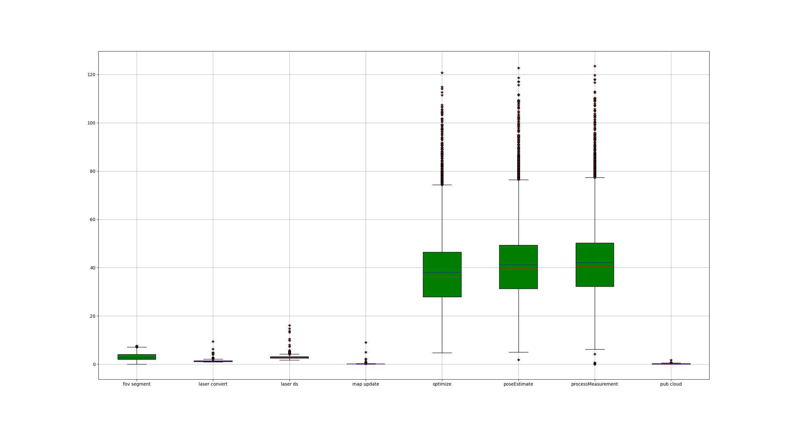

# hm-lio
HM-LIO: A Hash Map based LiDAR-Inertial Odometry.

**hm-lio**  is a hash-map based LiDAR-inertial odometry, and this is just my personal experimental demonstration. It manage the local map with hash-map as [**ct-icp**](https://github.com/jedeschaud/ct_icp), and the lio is a simple reproduction of [**FAST-LIO 1.0**](https://github.com/hku-mars/FAST_LIO).

**NOTE:** This is just my personal experimental demonstration, maybe some bugs, feel free to contact me.

## Main features
- Manage the local map with HashMpa
- A simple reproduction of fastlio 1.0 (use eigen instead of IKFoM)
- support online extrinsic calib
- add residual weight 
- a lidar process moudle


  
<div align="left">
 
</div>

- [Video-Bilibili](https://www.bilibili.com/video/BV1Hp4y157wW/?vd_source=438f630fe29bd5049b24c7f05b1bcaa3)

### Some test results are show below:

#### Velodyne 32, NCLT dataset

 

#### velodyne-16, Kaist dataset


 


#### Robosense RS16, personal dataset


 


## 1. Prerequisites

### 1.1 **Ubuntu** and **ROS**
**Ubuntu >= 18.04**

For **Ubuntu 18.04 or higher**, the **default** PCL and Eigen is enough for ct_lio to work normally.

ROS    >= Melodic. [ROS Installation](http://wiki.ros.org/ROS/Installation)

### 1.2. **PCL && Eigen**
PCL    >= 1.8,   Follow [PCL Installation](http://www.pointclouds.org/downloads/linux.html).

Eigen  >= 3.3.4, Follow [Eigen Installation](http://eigen.tuxfamily.org/index.php?title=Main_Page).


## 2. Build

Clone the repository and catkin_make:

**NOTE**:**[This is import]** before catkin_make, make sure your dependency is right(you can change in ./cmake/packages.cmake)

```
    cd ~/$A_ROS_DIR$/src
    git clone https://github.com/chengwei0427/hm-lio.git
    cd hm_lio
    cd ../..
    catkin_make
    source devel/setup.bash
```

- If you want to use a custom build of PCL, add the following line to ~/.bashrc
```export PCL_ROOT={CUSTOM_PCL_PATH}```
  
## 3. Directly run

**Noted:**

**A**. Please make sure the IMU and LiDAR are **Synchronized**, that's important.

**B**. The warning message "Failed to find match for field 'time'." means the timestamps of each LiDAR points are missed in the rosbag file. That is important for the forward propagation and backwark propagation.

**C**. Before run with **NCLT** dataset, you should change time-scale in **cloud_convert.cpp**( static double tm_scale = 1e6)


## 4. Rosbag Example

Run:
```
roslaunch hm_lio run_eskf.launch
cd YOUR_BAG_DOWNLOADED_PATH
rosbag play *
```

### 4.2 Time analysis

There is a time log file in **./log/** after run the code. we can plot the time with the scripts.
```
cd hm-lio
python3 ./scripts/all_time.py
```
<div align="left">
 
</div>

## Related Works
1. [ct_icp](https://github.com/jedeschaud/ct_icp):  Continuous-Time LiDAR Odometry .
2. [FAST-LIO](https://github.com/hku-mars/FAST_LIO): A computationally efficient and robust LiDAR-inertial odometry (LIO) package.
3. [robin-map](https://github.com/Tessil/robin-map): A C++ implementation of a fast hash map and hash set using robin hood hashing.
4. [IESKF-LIO](https://github.com/chengwei0427/ESKF_LIO): A reproduction of Fast-lio.


## TBD
1. More experiments.
2. Fix bug.

